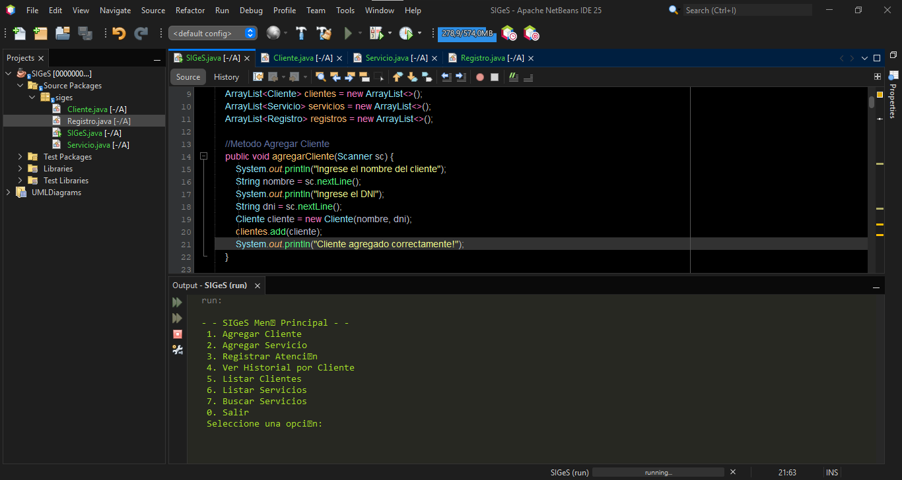

# SIGeS (Sistema Integral de Gestión de Servicios)

Aplicación Java de consola para gestionar clientes, servicios y atenciones registradas.  
Desarrollado como proyecto educativo simulando un entorno profesional con control de versiones en Git.

---

## Funcionalidades actuales

- Agregar cliente
- Agregar servicio
- Registrar atención con fecha
- Ver historial de atenciones por cliente
- Listar clientes
- Listar servicios
- Buscar servicio por palabra clave

---

## Próximas funcionalidades

- Evitar clientes duplicados
- Eliminar cliente por DNI
- Listar servicios por costo mayor a un valor dado
- Mostrar total gastado por cada cliente
- Contar servicios más usados
- Modificar datos del cliente

---

## Captura del programa

---

## Estructura del proyecto

src/
├── Cliente.java
├── Servicio.java
├── Registro.java
└── SIGeS.java

## Cómo ejecutar

1. Cloná este repositorio
2. Abrilo con NetBeans, IntelliJ o cualquier editor Java
3. Ejecutá el método `main` de `SIGeS.java`

---

## Autor

**Martín Leiza**  
Estudiante de Tecnicatura Universitaria en Desarrollo de Software (Universidad de La Punta)
San Luis, Argentina. 

---